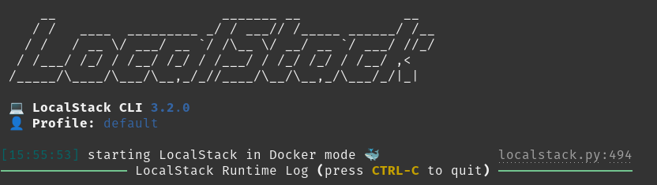
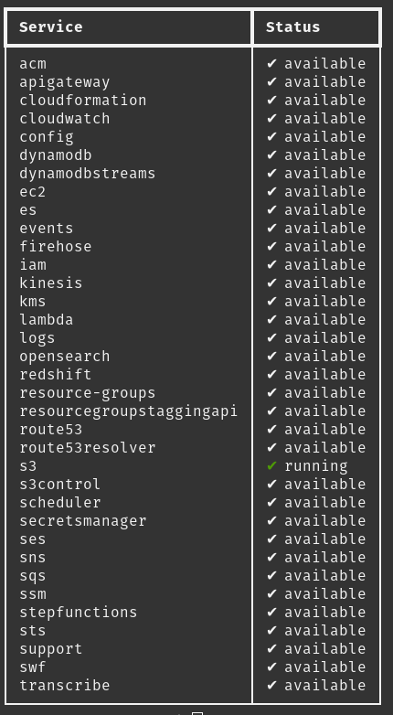

# **Instalação do LocalStack**

LocalStack é uma ferramenta que simula serviços da AWS localmente. Aqui está como você pode instalá-lo em macOS, Linux e Windows.

## **macOS**

1. **Instale o Python**  
   Verifique se o Python está instalado com `python3 --version`. Se necessário, instale-o usando o Homebrew:
   ```
   brew install python
   ```

2. **Instale o LocalStack**  
   Use o pip para instalar o LocalStack:
   ```
   pip install localstack
   ```

3. **Inicie o LocalStack**  
   Execute o LocalStack com:
   ```
   localstack start
   ```

4. **Verifique a instalação**  
   Verifique se os serviços do LocalStack estão operacionais usando:
   ```
   localstack status services
   ```

---

## **Linux**

1. **Instale o Python**  
   A maioria das distribuições Linux vem com o Python. Verifique com `python3 --version`. Se necessário, instale-o com:
   ```
   sudo apt install python3
   ```

2. **Instale o LocalStack**  
   Instale o LocalStack utilizando o pip:
   ```
   pip install localstack
   ```

3. **Inicie o LocalStack**  
   Inicie com:
   ```
   localstack start
   ```

4. **Verifique a instalação**  
   Confirme que os serviços estão funcionando com:
   ```
   localstack status services
   ```

---

## **Windows**

1. **Instale o Python**  
   Se necessário, instale o Python a partir do [site oficial do Python](https://www.python.org/downloads/) e adicione ao PATH durante a instalação.

2. **Instale o LocalStack**  
   No Prompt de Comando, instale o LocalStack com:
   ```
   pip install localstack
   ```

3. **Inicie o LocalStack**  
   Execute o LocalStack usando:
   ```
   localstack start
   ```

4. **Verifique a instalação**  
   Verifique a operacionalidade dos serviços com:
   ```
   localstack status services
   ```

---
# Referência de imagens dos serviços rodando

## `$ localstack start`


## `$ localstack status services`
